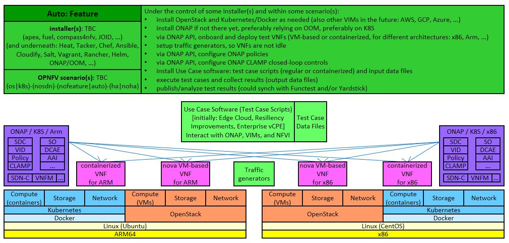
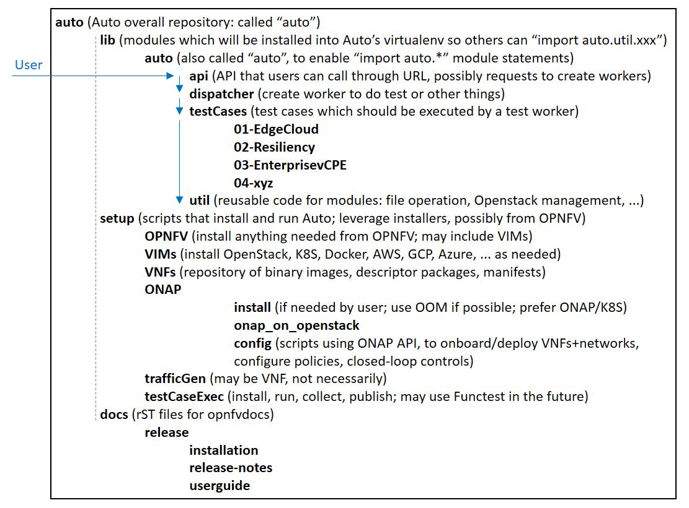
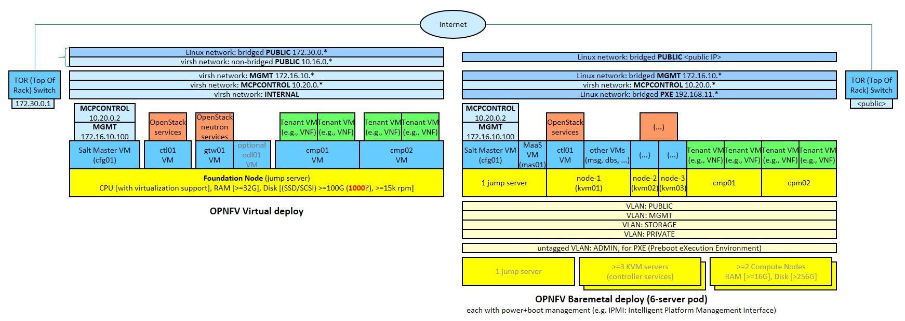

.. This work is licensed under a Creative Commons Attribution 4.0 International License.
.. http://creativecommons.org/licenses/by/4.0
.. SPDX-License-Identifier CC-BY-4.0
.. (c) Open Platform for NFV Project, Inc. and its contributors

Introduction
============

This document describes the software and hardware reference frameworks used by Auto,
and provides guidelines on how to perform configurations and additional installations.

Goal
====

The goal of `Auto <http://docs.opnfv.org/en/latest/release/release-notes.html>`_ installation and configuration is to prepare
an environment where the `Auto use cases <http://docs.opnfv.org/en/latest/submodules/auto/docs/release/userguide/index.html#auto-userguide>`_
can be assessed, i.e. where the corresponding test cases can be executed and their results can be collected.

An instance of ONAP needs to be present, as well as a number of deployed VNFs, in the scope of the use cases.

The initial Auto use cases cover:

* Edge Cloud (increased autonomy and automation for managing Edge VNFs)
* Resilience Improvements through ONAP (reduced recovery time for VNFs and end-to-end services in case of failure or suboptimal performance)
* Enterprise vCPE (automation, cost optimization, and performance assurance of enterprise connectivity to Data Centers, Internet service)

The general idea of Auto is to install an OPNFV environment (comprising at least one Cloud Manager),
an ONAP instance, ONAP-deployed VNFs as required by use cases, possibly additional cloud managers not
already installed during the OPNFV environment setup, traffic generators, and the Auto-specific software
for the use cases (which can include test frameworks such as Robot or Functest). The ONAP instance needs
to be configured with policies and closed-loop controls (also as required by use cases), and the test
framework controls the execution and result collection of all the test cases.

The following diagram illustrates two execution environments, for x86 architectures and for Arm architectures.
The installation process depends on the underlying architecture, since certain components may require a
specific binary-compatible version for a given x86 or Arm architecture. The preferred variant of ONAP is one
that runs on Kubernetes, while all VNF types are of interest to Auto: VM-based or containerized (on any cloud
manager), for x86 or for Arm. The initial VM-based VNFs will cover Openstack, and in future versions,
additional cloud managers will be considered. The configuration of ONAP and of test cases should not depend
on the architecture.

For each component, various installer tools will be selected (based on simplicity and performance), and
may change from one Auto release to the next. For example, the most natural installer for ONAP should be
OOM (ONAP Operations Manager).

The initial version of Auto will focus on Openstack VM-based VNFs, onboarded and deployed via ONAP API
(not by ONAP GUI, for the purpose of automation). ONAP is installed on Kubernetes. Two servers from LaaS
are used: one to support an Openstack instance as provided by the OPNFV installation via Fuel/MCP, and
the other to support ONAP with Kubernetes and Docker. Therefore, the VNF execution environment is the
server with the Openstack instance.

.. image:: auto-installTarget-initial.jpg

Jenkins will be used for Continuous Integration in OPNFV releases, to ensure that the latest master
branch of Auto is always working.

Moreover, Auto will offer an API, which can be imported as a module, and can be accessed for example
by a web application. The following diagram shows the planned structure for the Auto Git repository,
supporting this module, as well as the installation scripts, test case software, utilities, and documentation.

Pre-configuration activities
============================

The following resources will be required for the initial version of Auto:

* two LaaS (OPNFV Lab-as-a-Service) pods, with their associated network information. Later, other types of target pods will be supported.
* the `Auto Git repository <https://git.opnfv.org/auto/tree/>`_  (clone from `Gerrit Auto <https://gerrit.opnfv.org/gerrit/#/admin/projects/auto>`_)

Hardware configuration
======================

<TBC>

Feature configuration
=====================

Environment installation
^^^^^^^^^^^^^^^^^^^^^^^^

Current Auto work in progress is captured in the `Auto Lab Deployment wiki page <https://wiki.opnfv.org/display/AUTO/Auto+Lab+Deployment>`_.

OPNFV with Openstack
~~~~~~~~~~~~~~~~~~~~

The Auto installation uses the Fuel/MCP installer for the OPNF environment (see the
`OPNFV download page <https://www.opnfv.org/software/downloads>`_).

The following figure summarizes the two installation cases: virtual or baremetal.
This OPNFV installer starts with installing a Salt Master, which then configures
subnets and bridges, and install VMs (e.g. for controllers and compute nodes)
and an Openstack instance with predefined credentials.

The Auto version of OPNFV installation configures additional resources for the Openstack virtual pod,
as compared to the default installation. Examples of manual steps are as follows:

.. code-block:: console

    1. mkdir /opt/fuel
    2. cd /opt/fuel
    3. git clone https://git.opnfv.org/fuel
    4. cd fuel
    5. vi /opt/fuel/fuel/mcp/config/scenario/os-nosdn-nofeature-noha.yaml

These lines can be added to configure more resources:

.. code-block:: yaml

       gtw01:
         ram: 2048
    +  cmp01:
    +    vcpus: 16
    +    ram: 65536
    +    disk: 40
    +  cmp02:
    +    vcpus: 16
    +    ram: 65536
    +    disk: 40

The final step deploys Openstack (duration: approximately between 30 and 45 minutes).

.. code-block:: console

    6. ci/deploy.sh -l UNH-LaaS -p virtual1 -s os-nosdn-nofeature-noha -D |& tee deploy.log

ONAP on Kubernetes
~~~~~~~~~~~~~~~~~~

An ONAP installation on Openstack has also been investigated, but we focus here on
the ONAP on Kubernetes version.

The initial focus is on x86 architectures.

For Arm architectures, the ONAP DCAE component for a while was not operational on Kubernetes,
and had to be installed separately on Openstack. So the ONAP instance was a hybrid, with all
components except DCAE running on Kubernetes, and DCAE running separately on Openstack.
The goal for the first release of Auto is to use an ONAP instance where DCAE also runs on Kubernetes,
even on Arm architectures. Specialized Docker images are being developed to provide Arm architecture
binary compatibility.

The ONAP reference for this installation is detailed `here <https://wiki.onap.org/display/DW/ONAP+on+Kubernetes>`_.

Examples of manual steps for the deploy procedure are as follows:

.. code-block:: console

    1  git clone https://gerrit.onap.org/r/oom
    2  cd oom
    3  git pull https://gerrit.onap.org/r/oom refs/changes/19/32019/6
    4  cd install/rancher
    5  ./oom_rancher_setup.sh -b master -s <your external ip> -e onap
    6  cd oom/kubernetes/config
    7  (modify onap-parameters.yaml for VIM connection (manual))
    8  ./createConfig.sh -n onap
    9  cd ../oneclick
    10 ./createAll.bash -n onap

ONAP configuration
^^^^^^^^^^^^^^^^^^

This section describes the logical steps performed by the Auto scripts to prepare ONAP and VNFs.

VNF deployment
~~~~~~~~~~~~~~

<TBC; pre-onboarding, onboarding, deployment>

Policy and closed-loop control configuration
~~~~~~~~~~~~~~~~~~~~~~~~~~~~~~~~~~~~~~~~~~~~

<TBC>

Traffic Generator configuration
^^^^^^^^^^^^^^^^^^^^^^^^^^^^^^^

<TBC>

Test Case software installation and execution control
^^^^^^^^^^^^^^^^^^^^^^^^^^^^^^^^^^^^^^^^^^^^^^^^^^^^^

<TBC>

Installation health-check
=========================

<TBC; the Auto installation will self-check, but indicate here manual steps to double-check that the installation was successful>

References
==========

`Auto wiki main page <https://wiki.opnfv.org/pages/viewpage.action?pageId=12389095>`_

