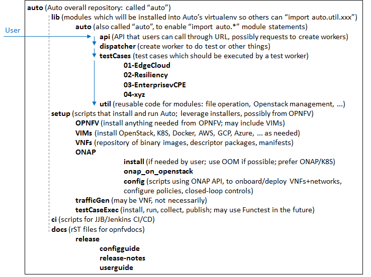

.. This work is licensed under a Creative Commons Attribution 4.0 International License.
.. http://creativecommons.org/licenses/by/4.0
.. SPDX-License-Identifier CC-BY-4.0
.. (c) Open Platform for NFV Project, Inc. and its contributors

Introduction
============

This document describes the software and hardware reference frameworks used by Auto,
and provides guidelines on how to perform configurations and additional installations.

Goal
====

The goal of `Auto <http://docs.opnfv.org/en/latest/submodules/auto/docs/release/release-notes/index.html#auto-releasenotes>`_
installation and configuration is to prepare an environment where the
`Auto use cases <http://docs.opnfv.org/en/latest/submodules/auto/docs/release/userguide/index.html#auto-userguide>`_
can be assessed, i.e. where the corresponding test cases can be executed and their results can be collected for analysis.
See the `Auto Release Notes <https://docs.opnfv.org/en/latest/submodules/auto/docs/release/release-notes/index.html#auto-releasenotes>`_
for a discussion of the test results analysis loop.

An instance of ONAP needs to be present, as well as a number of deployed VNFs, in the scope of the use cases.
Simulated traffic needs to be generated, and then test cases can be executed. There are multiple parameters to
the Auto environment, and the same set of test cases will be executed on each environment, so as to be able to
evaluate the influence of each environment parameter.

The initial Auto use cases cover:

* **Edge Cloud** (increased autonomy and automation for managing Edge VNFs)
* **Resilience Improvements through ONAP** (reduced recovery time for VNFs and end-to-end services in case of failure
  or suboptimal performance)
* **Enterprise vCPE** (automation, cost optimization, and performance assurance of enterprise connectivity to Data Centers
  and the Internet)

The general idea of the Auto feature configuration is to install an OPNFV environment (comprising at least one Cloud Manager),
an ONAP instance, ONAP-deployed VNFs as required by use cases, possibly additional cloud managers not
already installed during the OPNFV environment setup, traffic generators, and the Auto-specific software
for the use cases (which can include test frameworks such as `Robot <http://robotframework.org/>`_ or
`Functest <http://docs.opnfv.org/en/latest/submodules/functest/docs/release/release-notes/index.html#functest-releasenotes>`_).

The ONAP instance needs to be configured with policies and closed-loop controls (also as required by use cases),
and the test framework controls the execution and result collection of all the test cases. Then, test case execution
results can be analyzed, so as to fine-tune policies and closed-loop controls, and to compare environment parameters.

The following diagram illustrates execution environments, for x86 architectures and for Arm architectures,
and other environment parameters (see the Release Notes for a more detailed discussion on the parameters).
The installation process depends on the underlying architecture, since certain components may require a
specific binary-compatible version for a given x86 or Arm architecture. The preferred variant of ONAP is one
that runs on Kubernetes, while all VNF types are of interest to Auto: VM-based or containerized (on any cloud
manager), for x86 or for Arm. In fact, even PNFs could be considered, to support the evaluation of hybrid PNF/VNF
transition deployments (ONAP has the ability of also managing legacy PNFs).

The initial VM-based VNFs will cover OpenStack, and in future Auto releases, additional cloud managers will be considered.
The configuration of ONAP and of test cases should not depend on the underlying architecture and infrastructure.

For each component, various installer tools will be considered (as environment parameters), so as to enable comparison,
as well as ready-to-use setups for Auto end-users. For example, the most natural installer for ONAP would be
OOM (ONAP Operations Manager). For the OPNFV infrastructure, supported installer projects will be used: Fuel/MCP,
Compass4NFV, Apex/TripleO, Daisy4NFV. Note that JOID was last supported in OPNFV Fraser 6.2, and is not supported
anymore as of Gambia 7.0.

The initial version of Auto will focus on OpenStack VM-based VNFs, onboarded and deployed via ONAP API
(not by ONAP GUI, for the purpose of automation). ONAP is installed on Kubernetes. Two or more servers from LaaS
are used: one or more to support an OpenStack instance as provided by the OPNFV installation via Fuel/MCP or other
OPNFV installers (Compass4NFV, Apex/TripleO, Daisy4NFV), and the other(s) to support ONAP with Kubernetes
and Docker. Therefore, the VNF execution environment is composed of the server(s) with the OpenStack instance(s).
Initial tests will also include ONAP instances installed on bare-metal servers (i.e. not directly on an OPNFV
infrastructure; the ONAP/OPNFV integration can start at the VNF environment level; but ultimately, ONAP should
be installed within an OPNFV infrastructure, for full integration).

ONAP/K8S has several variants. The initial variant considered by Auto is the basic one recommended by ONAP,
which relies on the Rancher installer and on OpenStack VMs providing VMs for the Rancher master and for the
Kubernetes cluster workers, as illustrated below for ONAP-Beijing release:

The OpenStack instance running VNFs may need to be configured as per ONAP expectations, for example creating
instances of ONAP projects/tenants, users, security groups, networks (private, public), connected to the
Internet by a Router, and making sure expected VM images and flavors are present. A script (using OpenStack
SDK, or OpenStack CLI, or even OpenStack Heat templates) would populate the OpenStack instance, as illustrated below:

.. image:: auto-OS-config4ONAP.png

That script can also delete these created objects, so it can be used in tear-down procedures as well
(use -del or --delete option). It is located in the `Auto repository <https://git.opnfv.org/auto/tree/>`_ ,
under the setup/VIMs/OpenStack directory:

* auto_script_config_openstack_for_onap.py

Jenkins (or more precisely JJB: Jenkins Job Builder) will be used for Continuous Integration in OPNFV releases,
to ensure that the latest master branch of Auto is always working. The first 3 tasks in the pipeline would be:
install OpenStack instance via an OPNFV installer (Fuel/MCP, Compass4NFV, Apex/TripleO, Daisy4NFV), configure
the OpenStack instance for ONAP, install ONAP (using the OpenStack instance network IDs in the ONAP YAML file).

Moreover, Auto will offer an API, which can be imported as a module, and can be accessed for example
by a web application. The following diagram shows the planned structure for the Auto Git repository,
supporting this module, as well as the installation scripts, test case software, utilities, and documentation.

Pre-configuration activities
============================

The following resources will be required for the initial version of Auto:

* at least two LaaS (OPNFV Lab-as-a-Service) pods (or equivalent in another lab), with their associated network
  information. Later, other types of target pods will be supported, such as clusters (physical bare-metal or virtual).
  The pods can be either x86 or Arm CPU architectures. An effort is currently ongoing (ONAP Integration team, and Auto team),
  to ensure Arm binaries are available for all ONAP components in the official ONAP Docker registry.
* the `Auto Git repository <https://git.opnfv.org/auto/tree/>`_
  (clone from `Gerrit Auto <https://gerrit.opnfv.org/gerrit/#/admin/projects/auto>`_)

Hardware configuration
======================

<TBC; large servers, at least 512G RAM, 1TB storage, 80-100 CPU threads>

ONAP needs relatively large servers. Initial deployment attempts on single servers did not complete.
Current attempts use 3-server clusters, on bare-metal.

For initial VNF deployment environments, virtual deployments by OPNFV installers on a single server should suffice.
Later, if many large VNFs are deployed for the Auto test cases, and if heavy traffic is generated, more servers
might be necessary. Also, if many environment parameters are considered, full executions of all test cases
on all environment configurations could take a long time, so parallel executions of independent test case batches
on multiple sets of servers and clusters might be considered.

Feature configuration
=====================

Environment installation
^^^^^^^^^^^^^^^^^^^^^^^^

Current Auto work in progress is captured in the
`Auto Lab Deployment wiki page <https://wiki.opnfv.org/display/AUTO/Auto+Lab+Deployment>`_.

OPNFV with OpenStack
~~~~~~~~~~~~~~~~~~~~

The first Auto installation used the Fuel/MCP installer for the OPNFV environment (see the
`OPNFV download page <https://www.opnfv.org/software/downloads>`_).

The following figure summarizes the two installation cases for Fuel: virtual or bare-metal.
This OPNFV installer starts with installing a Salt Master, which then configures
subnets and bridges, and install VMs (e.g., for controllers and compute nodes)
and an OpenStack instance with predefined credentials.

The Auto version of OPNFV installation configures additional resources for the OpenStack virtual pod
(more virtual CPUs and more RAM), as compared to the default installation. Examples of manual steps are as follows:

.. code-block:: console

    1. mkdir /opt/fuel
    2. cd /opt/fuel
    3. git clone https://git.opnfv.org/fuel
    4. cd fuel
    5. vi /opt/fuel/fuel/mcp/config/scenario/os-nosdn-nofeature-noha.yaml

These lines can be added to configure more resources:

.. code-block:: yaml

       gtw01:
         ram: 2048
    +  cmp01:
    +    vcpus: 32
    +    ram: 196608
    +  cmp02:
    +    vcpus: 32
    +    ram: 196608

The final steps deploy OpenStack (duration: approximately between 30 and 45 minutes).

.. code-block:: console

    # The following change will provide more space to VMs. Default is 100G per cmp0x. This gives 350 each and 700 total.
    6. sed -i mcp/scripts/lib.sh -e 's/\(qemu-img create.*\) 100G/\1 350G/g'

    # Then deploy OpenStack. It should take between 30 and 45 minutes:
    7. ci/deploy.sh -l UNH-LaaS -p virtual1 -s os-nosdn-nofeature-noha -D |& tee deploy.log

    # Lastly, to get access to the extra RAM and vCPUs, adjust the quotas (done on the controller at 172.16.10.36):
    8. openstack quota set --cores 64 admin
    9. openstack quota set --ram 393216 admin

Note:

* with Linux Kernel 4.4, the installation of OPNFV is not working properly (seems to be a known bug of 4.4, as it works correctly with 4.13):
  neither qemu-nbd nor kpartx are able to correctly create a mapping to /dev/nbd0p1 partition in order to resize it to 3G (see Fuel repository,
  file `mcp/scripts/lib.sh <https://git.opnfv.org/fuel/tree/mcp/scripts/lib.sh>`_ , function mount_image).
* it is not a big deal in case of x86, because it is still possible to update the image and complete the installation even with the
  original partition size.
* however, in the case of ARM, the OPNFV installation will fail, because there isn't enough space to install all required packages into
  the cloud image.

Using the above as starting point, Auto-specific scripts have been developed, for each of the 4 OPNFV installers Fuel/MCP,
Compass4NFV, Apex/TripleO, Daisy4NFV. Instructions for virtual deployments from each of these installers have been used, and
sometimes expanded and clarified (missing details or steps from the instructions).
They can be found in the `Auto repository <https://git.opnfv.org/auto/tree/>`_ , under the ci directory:

* deploy-opnfv-fuel-ubuntu.sh
* deploy-opnfv-compass-ubuntu.sh
* deploy-opnfv-apex-centos.sh
* deploy-opnfv-daisy-centos.sh

ONAP on Kubernetes
~~~~~~~~~~~~~~~~~~

An ONAP installation on OpenStack has also been investigated, but we focus here on
the ONAP on Kubernetes version.

The initial focus is on x86 architectures. The ONAP DCAE component for a while was not operational
on Kubernetes (with ONAP Amsterdam), and had to be installed separately on OpenStack. So the ONAP
instance was a hybrid, with all components except DCAE running on Kubernetes, and DCAE running
separately on OpenStack. Starting with ONAP Beijing, DCAE also runs on Kubernetes.

For Arm architectures, specialized Docker images are being developed to provide Arm architecture
binary compatibility. See the `Auto Release Notes <https://docs.opnfv.org/en/latest/submodules/auto/docs/release/release-notes/index.html#auto-releasenotes>~_
for more details on the availability status of these Arm images in the ONAP Docker registry.

The ONAP reference for this installation is detailed `here <http://onap.readthedocs.io/en/latest/submodules/oom.git/docs/oom_user_guide.html>`_.

Examples of manual steps for the deploy procedure are as follows:

.. code-block:: console

    1  git clone https://gerrit.onap.org/r/oom
    2  cd oom
    3  git pull https://gerrit.onap.org/r/oom refs/changes/19/32019/6
    4  cd install/rancher
    5  ./oom_rancher_setup.sh -b master -s <your external ip> -e onap
    6  cd oom/kubernetes/config
    7  (modify onap-parameters.yaml for VIM connection (manual))
    8  ./createConfig.sh -n onap
    9  cd ../oneclick
    10 ./createAll.bash -n onap

Several automation efforts to integrate the ONAP installation in Auto CI are in progress.
One effort involves using a 3-server cluster at OPNFV Pharos LaaS (Lab-as-a-Service).
The script is available in the `Auto repository <https://git.opnfv.org/auto/tree/>`_ , under the ci directory::

* deploy-onap.sh

ONAP configuration
^^^^^^^^^^^^^^^^^^

This section describes the logical steps performed by the Auto scripts to prepare ONAP and VNFs.

VNF deployment
~~~~~~~~~~~~~~

<TBC; pre-onboarding, onboarding, deployment>

Policy and closed-loop control configuration
~~~~~~~~~~~~~~~~~~~~~~~~~~~~~~~~~~~~~~~~~~~~

<TBC>

Traffic Generator configuration
^^^^^^^^^^^^^^^^^^^^^^^^^^^^^^^

<TBC>

Test Case software installation and execution control
^^^^^^^^^^^^^^^^^^^^^^^^^^^^^^^^^^^^^^^^^^^^^^^^^^^^^

<TBC; mention the management of multiple environments (characterized by their parameters), execution of all test cases
in each environment, only a subset in official OPNFV CI/CD Jenkins due to size and time limits; then posting and analysis
of results; failures lead to bug-fixing, successes lead to analysis for comparisons and fine-tuning>

Installation health-check
=========================

<TBC; the Auto installation will self-check, but indicate here manual steps to double-check that the
installation was successful>

References
==========

Auto Wiki pages:

* `Auto wiki main page <https://wiki.opnfv.org/pages/viewpage.action?pageId=12389095>`_
* `Auto Lab Deployment wiki page <https://wiki.opnfv.org/display/AUTO/Auto+Lab+Deployment>`_

OPNFV documentation on Auto:

* `Auto release notes <https://docs.opnfv.org/en/latest/submodules/auto/docs/release/release-notes/index.html#auto-releasenotes>`_
* `Auto use case user guides <http://docs.opnfv.org/en/latest/submodules/auto/docs/release/userguide/index.html#auto-userguide>`_

Git&Gerrit Auto repositories:

* `Auto Git repository <https://git.opnfv.org/auto/tree/>`_
* `Gerrit for Auto project <https://gerrit.opnfv.org/gerrit/#/admin/projects/auto>`_

