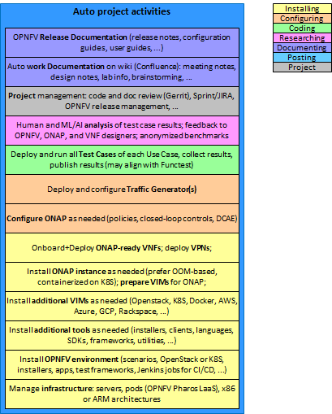

.. This work is licensed under a Creative Commons Attribution 4.0 International License.
.. http://creativecommons.org/licenses/by/4.0
.. SPDX-License-Identifier CC-BY-4.0
.. (c) Open Platform for NFV Project, Inc. and its contributors

Auto Release Notes
==================

This document provides the release notes for the Fraser release of Auto.

Important notes for this release
================================

The initial release for Auto was in Fraser 6.0 (project inception: July 2017). This is the second point release, in Fraser 6.2.

Summary
=======

Overview
^^^^^^^^

OPNFV is an SDNFV system integration project for open-source components, which so far have been mostly limited to
the NFVI+VIM as generally described by ETSI.

In particular, OPNFV has yet to integrate higher-level automation features for VNFs and end-to-end Services.

As an OPNFV project, Auto ("ONAP-Automated OPNFV") will focus on ONAP component integration and verification with
OPNFV reference platforms/scenarios, through primarily a post-install process, in order to avoid impact to OPNFV
installer projects. As much as possible, this will use a generic installation/integration process (not specific to
any OPNFV installer's technology).

* `ONAP <https://www.onap.org/>`_ (a Linux Foundation Project) is an open source software platform that delivers
  robust capabilities for the design, creation, orchestration, monitoring, and life cycle management of
  Software-Defined Networks (SDNs). The current release of ONAP is B (Beijing).

Auto aims at validating the business value of ONAP in general, but especially within an OPNFV infrastructure
(integration of ONAP and OPNFV). Business value is measured in terms of improved service quality (performance,
reliability, ...) and OPEX reduction (VNF management simplification, power consumption reduction, ...).

While all of ONAP is in scope, as it proceeds, the Auto project will focus on specific aspects of this integration
and verification in each release. Some example topics and work items include:

* How ONAP meets VNFM standards, and interacts with VNFs from different vendors
* How ONAP SDN-C uses OPNFV existing features, e.g. NetReady, in a two-layer controller architecture in which the
  upper layer (global controller) is replaceable, and the lower layer can use different vendor’s local controller to
  interact with SDN-C. For interaction with multiple cloud infrastructures, the MultiVIM ONAP component will be used.
* How ONAP leverages OPNFV installers (Fuel/MCP, Compass4NFV, Apex/TripleO, Daisy4NFV, JOID) to provide a cloud
  instance (starting with OpenStack) on which to install the tool ONAP
* What data collection interface VNF and controllers provide to ONAP DCAE, and (through DCAE), to closed-loop control
  functions such as Policy Tests which verify interoperability of ONAP automation/lifecycle features with specific NFVI
  and VIM features, as prioritized by the project with OPNFV technical community and
  EUAG (`End User Advisory Group <https://www.opnfv.org/end-users/end-user-advisory-group>`_) input.

  Examples:

  * Abstraction of networking tech/features e.g. through NetReady/Gluon
  * Blueprint-based VNF deployment (HOT, TOSCA, YANG)
  * Application level configuration and lifecycle through YANG (for any aspects depending upon OPNFV NFVI+VIM components)
  * Policy (through DCAE)
  * Telemetry (through VES/DCAE)

Initial areas of focus for Auto (in orange dotted lines; this scope can be expanded for future releases).
It is understood that:

* ONAP scope extends beyond the lines drawn below
* ONAP architecture does not necessarily align with the ETSI NFV inspired diagrams this is based upon

.. image:: auto-proj-rn01.png

The current ONAP architecture overview can be found `here <http://onap.readthedocs.io/en/latest/guides/onap-developer/architecture/onap-architecture.html>`_.

For reference, the ONAP-Beijing architecture diagram is replicated here:

Within OPNFV, Auto leverages tools and collaborates with other projects:

* use clouds/VIMs as installed in OPNFV infrastructure (e.g. OpenStack as installed by Fuel/MCP, Compass4NFV, etc.)
* include VNFs developed by OPNFV data plane groups (e.g., accelerated by VPP (Vector Packet Processing) with DPDK support, ...)
* validate ONAP+VNFs+VIMs on two major CPU architectures: x86 (CISC), Arm (RISC); collaborate with OPNFV/Armband
* work with other related groups in OPNFV:

  * FuncTest for software verification (CI/CD, Pass/Fail)
  * Yardstick for metric management (quantitative measurements)
  * VES (VNF Event Stream) and Barometer for VNF monitoring (feed to ONAP/DCAE)

* leverage OPNFV tools and infrastructure:

  * Pharos as LaaS: transient pods (3-week bookings) and permanent Arm pod (6 servers)
  * possibly other labs from the community
  * JJB/Jenkins for CI/CD (and follow OPNFV scenario convention)
  * Gerrit/Git for code and documents reviewing and archiving (similar to ONAP: Linux Foundation umbrella)
  * follow OPNFV releases (Releng group)

Testability
^^^^^^^^^^^

* Tests (test cases) will be developed for use cases within the project scope.
* In future releases, tests will be added to Functest runs for supporting scenarios.

Auto’s goals include the standup and tests for integrated ONAP-Cloud platforms (“Cloud” here being OPNFV “scenarios”
or other cloud environments). Thus, the artifacts would be tools to deploy ONAP (leveraging OOM whenever possible,
starting with Beijing release of ONAP, and a preference for the containerized version of ONAP), to integrate it with
clouds, to onboard and deploy test VNFs, to configure policies and closed-loop controls, and to run use-case defined
tests against that integrated environment. OPNFV scenarios would be a possible component in the above.

Installing Auto components and running a battery of tests will be automated, with some or all of the tests being
integrated in OPNFV CI/CD (depending on the execution length and resource consumption).

Combining all potential parameters, a full set of Auto test case executions can result in thousands of individual results.
The analysis of these results can be performed by humans, or even by ML/AI (Machine Learning, Artificial Intelligence).
Test results will be used to fine-tune policies and closed-loop controls configured in ONAP, for increased ONAP business
value (i.e., find/determine policies and controls which yield optimized ONAP business value metrics such as OPEX).

More precisely, the following list shows parameters that could be applied to an Auto full run of test cases:

* Auto test cases for given use cases
* OPNFV installer {Fuel/MCP, Compass4NFV, Apex/TripleO, Daisy4NFV, JOID}
* OPNFV availability scenario {HA, noHA}
* cloud where ONAP runs {OpenStack, AWS, GCP, Azure, ...}
* ONAP installation type {bare metal or virtual server, VM or container, ...} and options {MultiVIM single|distributed, ...}
* VNFs {vFW, vCPE, vAAA, vDHCP, vDNS, vHSS, ...} and VNF-based services {vIMS, vEPC, ...}
* cloud where VNFs run {OpenStack, AWS, GCP, Azure, ...}
* VNF type {VM-based, container}
* CPU architectures {x86/AMD64, ARM/aarch64} for ONAP software and for VNFs
* pod size and technology (RAM, storage, CPU cores/threads, NICs)
* traffic types and amounts/volumes
* ONAP configuration {especially policies and closed-loop controls; monitoring types for DCAE: VES, ...}
* versions of every component {Linux OS (Ubuntu, CentOS), OPNFV release, clouds, ONAP, VNFs, ...}

Illustration of Auto analysis loop based on test case executions:

.. image:: auto-proj-tests.png

Auto currently defines three use cases: Edge Cloud (UC1), Resiliency Improvements (UC2), and Enterprise vCPE (UC3). These use cases aim to show:

* increased autonomy of Edge Cloud management (automation, catalog-based deployment). This use case relates to the
  `OPNFV Edge Cloud <https://wiki.opnfv.org/display/PROJ/Edge+cloud>`_ initiative.
* increased resilience (i.e. fast VNF recovery in case of failure or problem, thanks to closed-loop control),
  including end-to-end composite services of which a Cloud Manager may not be aware (VMs or containers could be
  recovered by a Cloud Manager, but not necessarily an end-to-end service built on top of VMs or containers).
* enterprise-grade performance of vCPEs (certification during onboarding, then real-time performance assurance with
  SLAs and HA as well as scaling).

The use cases define test cases, which initially will be independent, but which might eventually be integrated to `FuncTest <https://wiki.opnfv.org/display/functest/Opnfv+Functional+Testing>`_.

Additional use cases can be added in the future, such as vIMS (example: project Clearwater) or residential vHGW (virtual
Home Gateways). The interest for vHGW is to reduce overall power consumption: even in idle mode, physical HGWs in
residential premises consume a lot of energy. Virtualizing that service to the Service Provider edge data center would
allow to minimize that consumption.

Lab environment
^^^^^^^^^^^^^^^

Target architectures for all Auto use cases and test cases include x86 and Arm. Power consumption analysis will be
performed, leveraging Functest tools (based on RedFish/IPMI/ILO).

Initially, an ONAP-Amsterdam instance (without DCAE) had been installed over Kubernetes on bare metal on a single-server
x86 pod at UNH IOL.

A transition is in progress, to leverage OPNFV LaaS (Lab-as-a-Service) pods (`Pharos <https://labs.opnfv.org/>`_).
These pods can be booked for 3 weeks only (with an extension for a maximum of 2 weeks), so they are not a permanent resource.

A repeatable automated installation procedure is being developed.

ONAP-based onboarding and deployment of VNFs is in progress (ONAP-Amsterdam pre-loading of VNFs must still done outside
of ONAP: for VM-based VNFs, users need to prepare OpenStack stacks (using Heat templates), then make an instance snapshot
which serves as the binary image of the VNF).

An initial version of a script to prepare an OpenStack instance for ONAP (creation of a public and a private network,
with a router) has been developed. It leverages OpenStack SDK.

Integration with Arm servers has started (exploring binary compatibility):

* OpenStack is currently installed on a 6-server pod of Arm servers
* A set of 14 additional Arm servers was deployed at UNH, for increased capacity
* Arm-compatible Docker images are in the process of being developed

Test case implementation for the three use cases has started.

OPNFV CI/CD integration with JJD (Jenkins Job Description) has started: see the Auto plan description
`here <https://wiki.opnfv.org/display/AUTO/CI+Plan+for+Auto>`_. The permanent resource for that is the 6-server Arm
pod, hosted at UNH. The CI directory from the Auto repository is `here <https://git.opnfv.org/auto/tree/ci>`_

Finally, the following figure illustrates Auto in terms of project activities:

Note: a demo was delivered at the OpenStack Summit in Vancouver on May 21st 2018, to illustrate the deployment of a WordPress application
(WordPress is a platform for websites and blogs) deployed on a multi-architecture cloud (mix of x86 and Arm servers).
This shows how service providers and enterprises can diversify their data centers with servers of different architectures,
and select architectures best suited to each use case (mapping application components to architectures: DBs, interactive servers,
number-crunching modules, ...).
This prefigures how other examples such as ONAP, VIMs, and VNFs could also be deployed on heterogeneous multi-architecture
environments (open infrastructure), orchestrated by Kubernetes. The Auto installation scripts could expand on that approach.

.. image:: auto-proj-openstacksummit1805.png

Release Data
============

+--------------------------------------+--------------------------------------+
| **Project**                          | Auto                                 |
|                                      |                                      |
+--------------------------------------+--------------------------------------+
| **Repo/commit-ID**                   | auto/opnfv-6.2.0                     |
|                                      |                                      |
+--------------------------------------+--------------------------------------+
| **Release designation**              | Fraser 6.2                           |
|                                      |                                      |
+--------------------------------------+--------------------------------------+
| **Release date**                     | 2018-06-29                           |
|                                      |                                      |
+--------------------------------------+--------------------------------------+
| **Purpose of the delivery**          | Official OPNFV release               |
|                                      |                                      |
+--------------------------------------+--------------------------------------+

Version change
^^^^^^^^^^^^^^

Module version changes
~~~~~~~~~~~~~~~~~~~~~~
- There have been no version changes.

Document version changes
~~~~~~~~~~~~~~~~~~~~~~~~
- There have been no version changes.

Reason for version
^^^^^^^^^^^^^^^^^^

Feature additions
~~~~~~~~~~~~~~~~~

Initial release 6.0:

* Fraser release plan
* use case descriptions
* test case descriptions
* in-progress test case development
* lab: OPNFV and ONAP (Amsterdam) installations

Point release 6.1:

* added Gambia release plan
* started integration with CI/CD (JJB) on permanent Arm pod
* Arm demo at OpenStack Summit
* initial script for configuring OpenStack instance for ONAP, using OpenStack SDK 0.13
* initial attempts to install ONAP Beijing
* alignment with OPNFV Edge Cloud
* initial contacts with Functest

Point release 6.2:

* initial scripts for OPNFV CI/CD, registration of Jenkins slave on `Arm pod <https://build.opnfv.org/ci/view/auto/>`_
* updated script for configuring OpenStack instance for ONAP, using OpenStack SDK 0.14

Notable activities since release 6.1, which may result in new features for Gambia 7.0:
* researching how to configure multiple Pharos servers in a cluster for Kubernetes
* started to evaluate Compass4nfv as another OpenStack installer; issues with Python version (2 or 3)
* common meeting with Functest
* Plugfest: initiated collaboration with ONAP/MultiVIM (including support for ONAP installation)

**JIRA TICKETS for this release:**

+--------------------------------------+--------------------------------------+
| **JIRA REFERENCE**                   | **SLOGAN**                           |
|                                      |                                      |
+--------------------------------------+--------------------------------------+
| AUTO-37, Get DCAE running onto       | Lab: Create a procedure to get DCAE  |
|   Pharos deployment                  | running on proper VIM                |
+--------------------------------------+--------------------------------------+
| AUTO-40, Install ONAP successfully;  | Lab: Prepare specification of        |
|   capture steps/Wiki                 | automated installation script        |
+--------------------------------------+--------------------------------------+
| AUTO-35, auto-edge-env-002           | UC1: Basic VNF environment check     |
|                                      |                                      |
+--------------------------------------+--------------------------------------+
| AUTO-38, auto-resiliency-vif-001:    | UC2: validate VM suspension command  |
|   2/3 Test Logic                     | and measurement of Recovery Time     |
+--------------------------------------+--------------------------------------+
|                                      |                                      |
|                                      |                                      |
+--------------------------------------+--------------------------------------+

Bug corrections
~~~~~~~~~~~~~~~

**JIRA TICKETS:**

+--------------------------------------+--------------------------------------+
| **JIRA REFERENCE**                   | **SLOGAN**                           |
|                                      |                                      |
+--------------------------------------+--------------------------------------+
|                                      |                                      |
|                                      |                                      |
+--------------------------------------+--------------------------------------+
|                                      |                                      |
|                                      |                                      |
+--------------------------------------+--------------------------------------+

Deliverables
============

Software deliverables
^^^^^^^^^^^^^^^^^^^^^

6.2 release: in-progress install scripts, CI scripts, and test case implementations.

Documentation deliverables
^^^^^^^^^^^^^^^^^^^^^^^^^^

Updated versions of:

* Release Notes (this document)
* User Guide
* Configuration Guide

(see links in References section)

Known Limitations, Issues and Workarounds
=========================================

System Limitations
^^^^^^^^^^^^^^^^^^

* ONAP still to be validated for Arm servers (many Docker images are ready)
* ONAP installation still to be automated in a repeatable way, and need to configure cluster of Pharos servers

Known issues
^^^^^^^^^^^^

None at this point.

**JIRA TICKETS:**

+--------------------------------------+--------------------------------------+
| **JIRA REFERENCE**                   | **SLOGAN**                           |
|                                      |                                      |
+--------------------------------------+--------------------------------------+
|                                      |                                      |
|                                      |                                      |
+--------------------------------------+--------------------------------------+
|                                      |                                      |
|                                      |                                      |
+--------------------------------------+--------------------------------------+

Workarounds
^^^^^^^^^^^

None at this point.

Test Result
===========

None at this point.

+--------------------------------------+--------------------------------------+
| **TEST-SUITE**                       | **Results:**                         |
|                                      |                                      |
+--------------------------------------+--------------------------------------+
|                                      |                                      |
|                                      |                                      |
+--------------------------------------+--------------------------------------+
|                                      |                                      |
|                                      |                                      |
+--------------------------------------+--------------------------------------+

References
==========

For more information on the OPNFV Fraser release, please see:
http://opnfv.org/fraser

Auto Wiki pages:

* `Auto wiki main page <https://wiki.opnfv.org/pages/viewpage.action?pageId=12389095>`_

OPNFV documentation on Auto:

* `Auto release notes <http://docs.opnfv.org/en/latest/submodules/auto/docs/release/release-notes/index.html#auto-releasenotes>`_
* `Auto use case user guides <http://docs.opnfv.org/en/latest/submodules/auto/docs/release/userguide/index.html#auto-userguide>`_
* `Auto configuration guide <http://docs.opnfv.org/en/latest/submodules/auto/docs/release/configguide/index.html#auto-configguide>`_

Git&Gerrit Auto repositories:

* `Auto Git repository <https://git.opnfv.org/auto/tree/>`_
* `Gerrit for Auto project <https://gerrit.opnfv.org/gerrit/#/admin/projects/auto>`_

Demo at OpenStack summit May 2018 (Vancouver, BC, Canada):

* YouTube video (10min 52s): `Integration testing on an OpenStack public cloud <https://youtu.be/BJ05YuusNYw>`_

