.. This work is licensed under a Creative Commons Attribution 4.0 International License.
.. http://creativecommons.org/licenses/by/4.0
.. SPDX-License-Identifier CC-BY-4.0
.. (c) Open Platform for NFV Project, Inc. and its contributors

================================================================
Auto User Guide: Use Case 2 Resiliency Improvements Through ONAP
================================================================

This document provides the user guide for Fraser release of Auto,
specifically for Use Case 2: Resiliency Improvements Through ONAP.

Description
===========

This use case illustrates VNF failure recovery time reduction with ONAP, thanks to its automated monitoring and management. It:

* simulates an underlying problem (failure, stress, or any adverse condition in the network that can impact VNFs)
* tracks a VNF
* measures the amount of time it takes for ONAP to restore the VNF functionality.

The benefit for NFV edge service providers is to assess what degree of added VIM+NFVI platform resilience for VNFs is obtained by leveraging ONAP closed-loop control, vs. VIM+NFVI self-managed resilience (which may not be aware of the VNF or the corresponding end-to-end Service, but only of underlying resources such as VMs and servers).

Also, a problem, or challenge, may not necessarily be a failure (which could also be recovered by other layers): it could be an issue leading to suboptimal performance, without failure. A VNF management layer as provided by ONAP may detect such non-failure problems, and provide a recovery solution which no other layer could provide in a given deployment.

Preconditions:

#. hardware environment in which Edge cloud may be deployed
#. Edge cloud has been deployed and is ready for operation
#. ONAP has been deployed onto a cloud and is interfaced (i.e. provisioned for API access) to the Edge cloud
#. Components of ONAP have been deployed on the Edge cloud as necessary for specific test objectives

In future releases, Auto Use cases will also include the deployment of ONAP (if not already installed), the deployment of test VNFs (pre-existing VNFs in pre-existing ONAP can be used in the test as well), the configuration of ONAP for monitoring these VNFs (policies, CLAMP, DCAE), in addition to the test scripts which simulate a problem and measures recovery time.

Different types of problems can be simulated, hence the identification of multiple test cases corresponding to this use case, as illustrated in this diagram:

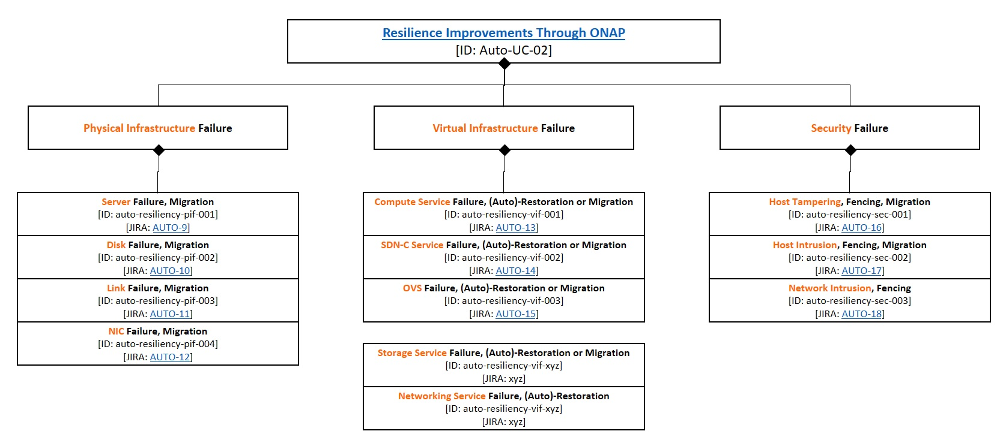

Description of simulated problems/challenges, leading to various test cases:

* Physical Infra Failure

  * Migration upon host failure: Compute host power is interrupted, and affected workloads are migrated to other available hosts.
  * Migration upon disk failure: Disk volumes are unmounted, and affected workloads are migrated to other available hosts.
  * Migration upon link failure: Traffic on links is interrupted/corrupted, and affected workloads are migrated to other available hosts.
  * Migration upon NIC failure: NIC ports are disabled by host commands, and affected workloads are migrated to other available hosts.

* Virtual Infra Failure

  * OpenStack compute host service fail: Core OpenStack service processes on compute hosts are terminated, and auto-restored, or affected workloads are migrated to other available hosts.
  * SDNC service fail: Core SDNC service processes are terminated, and auto-restored.
  * OVS fail: OVS bridges are disabled, and affected workloads are migrated to other available hosts.
  * etc.

* Security

  * Host tampering: Host tampering is detected, the host is fenced, and affected workloads are migrated to other available hosts.
  * Host intrusion: Host intrusion attempts are detected, an offending workload, device, or flow is identified and fenced, and as needed affected workloads are migrated to other available hosts.
  * Network intrusion: Network intrusion attempts are detected, and an offending flow is identified and fenced.

Test execution high-level description
=====================================

The following two MSCs (Message Sequence Charts) show the actors and high-level interactions.

The first MSC shows the preparation activities (assuming the hardware, network, cloud, and ONAP have already been installed): onboarding and deployment of VNFs (via ONAP portal and modules in sequence: SDC, VID, SO), and ONAP configuration (policy framework, closed-loops in CLAMP, activation of DCAE).

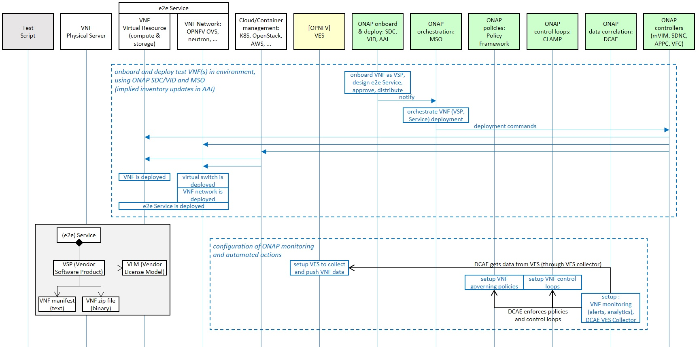

The second MSC illustrates the pattern of all test cases for the Resiliency Improvements:

* simulate the chosen problem (a.k.a. a "Challenge") for this test case, for example suspend a VM which may be used by a VNF
* start tracking the target VNF of this test case
* measure the ONAP-orchestrated VNF Recovery Time
* then the test stops simulating the problem (for example: resume the VM that was suspended)

In parallel, the MSC also shows the sequence of events happening in ONAP, thanks to its configuration to provide Service Assurance for the VNF.

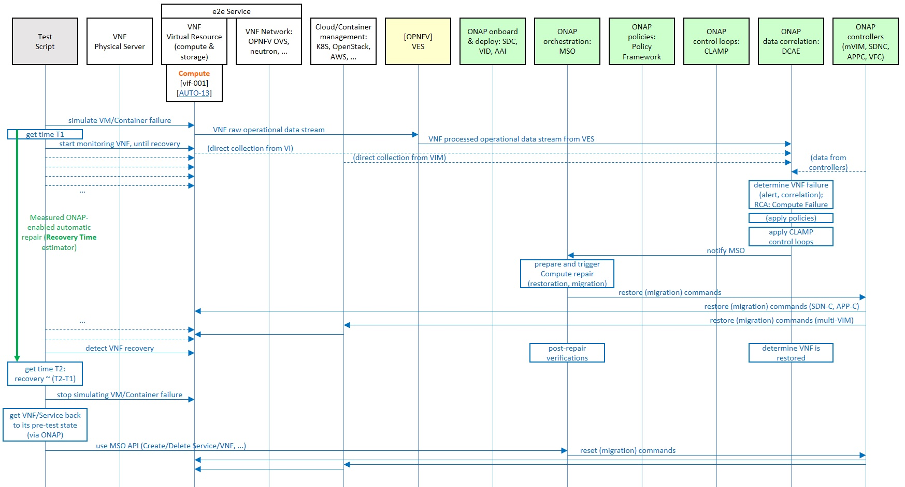

Test design: data model, implementation modules
===============================================

The high-level design of classes identifies several entities, described as follows:

* ``Test Case`` : as identified above, each is a special case of the overall use case (e.g., categorized by challenge type)
* ``Test Definition`` : gathers all the information necessary to run a certain test case
* ``Metric Definition`` : describes a certain metric that may be measured for a Test Case, in addition to Recovery Time
* ``Challenge Definition`` : describe the challenge (problem, failure, stress, ...) simulated by the test case
* ``Recipient`` : entity that can receive commands and send responses, and that is queried by the Test Definition or Challenge Definition (a recipient would be typically a management service, with interfaces (CLI or API) for clients to query)
* ``Resources`` : with 3 types (VNF, cloud virtual resource such as a VM, physical resource such as a server)

Three of these entities have execution-time corresponding classes:

* ``Test Execution`` , which captures all the relevant data of the execution of a Test Definition
* ``Challenge Execution`` , which captures all the relevant data of the execution of a Challenge Definition
* ``Metric Value`` , which captures the quantitative measurement of a Metric Definition (with a timestamp)

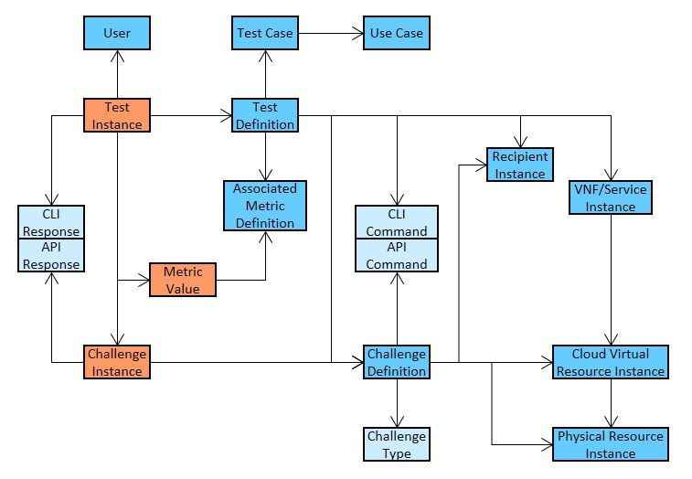

The following diagram illustrates an implementation-independent design of the attributes of these entities:

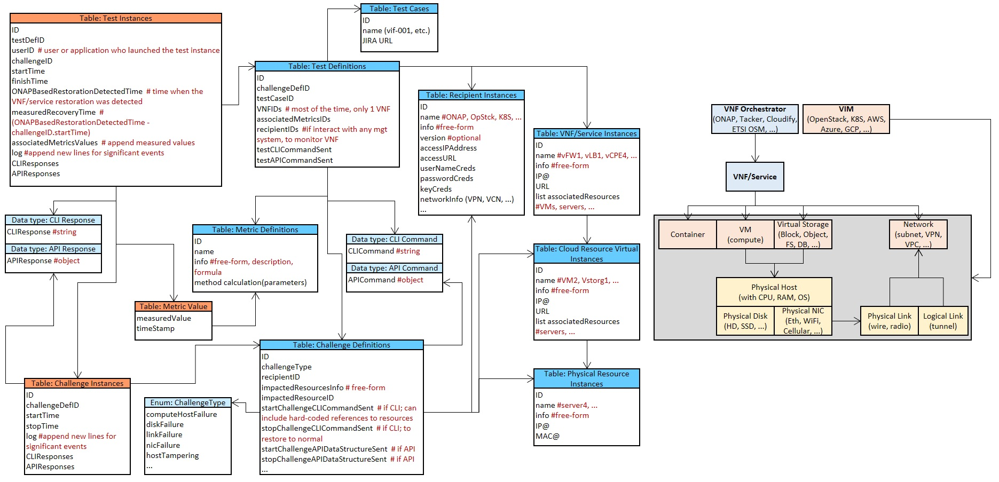

This next diagram shows the Python classes and attributes, as implemented by this Use Case (for all test cases):

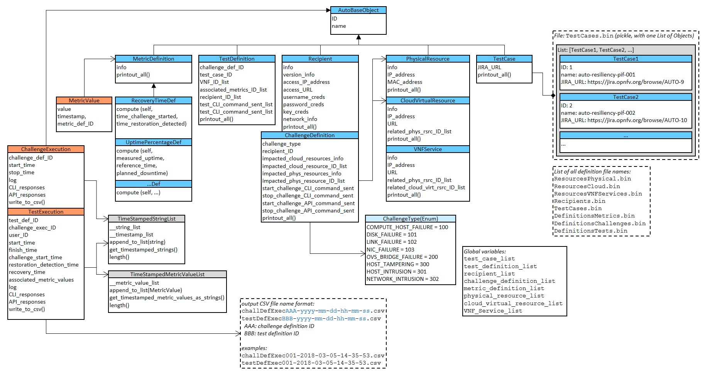

Test definition data is stored in serialization files (Python pickles), while test execution data is stored in CSV files, for easier post-analysis.

The module design is straightforward: functions and classes for managing data, for interfacing with recipients, for executing tests, and for interacting with the test user (choosing a Test Definition, showing the details of a Test Definition, starting the execution).

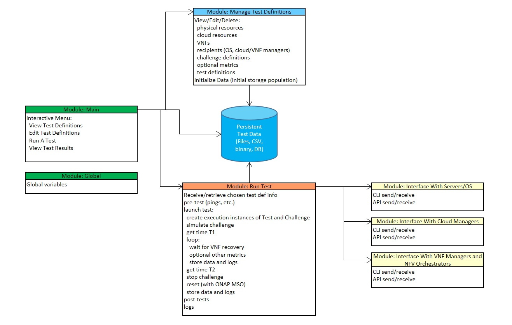

This last diagram shows the test user menu functions, when used interactively:

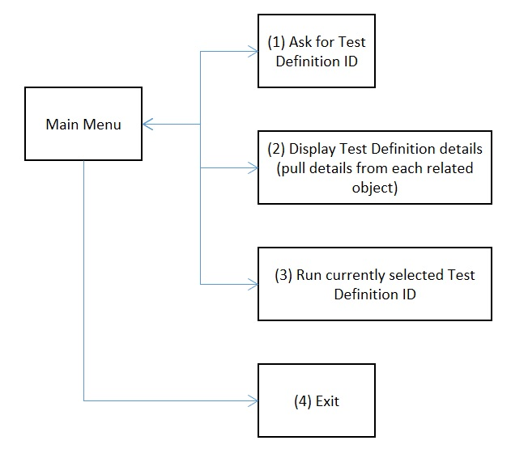

In future releases of Auto, testing environments such as Robot, FuncTest and Yardstick might be leveraged. Use Case code will then be invoked by API, not by a CLI interaction.

Also, anonymized test results could be collected from users willing to share them, and aggregates could be
maintained as benchmarks.

As further illustration, the next figure shows cardinalities of class instances: one Test Definition per Test Case, multiple Test Executions per Test Definition, zero or one Recovery Time Metric Value per Test Execution (zero if the test failed for any reason, including if ONAP failed to recover the challenge), etc.

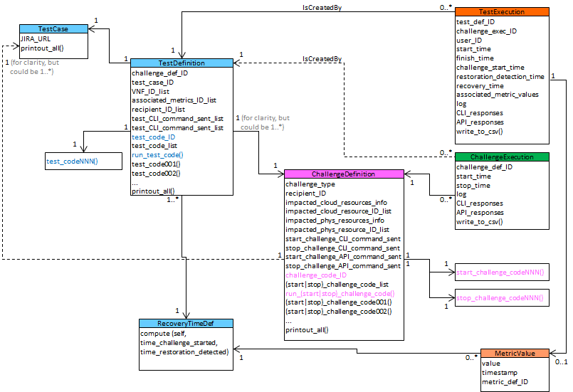

In this particular implementation, both Test Definition and Challenge Definition classes have a generic execution method (e.g., ``run_test_code()`` for Test Definition) which can invoke a particular script, by way of an ID (which can be configured, and serves as a script selector for each Test Definition instance). The overall test execution logic between classes is show in the next figure.

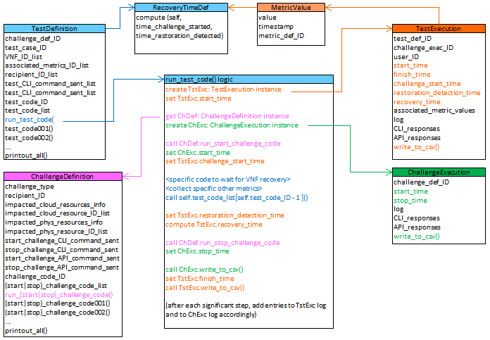

The execution of a test case starts with invoking the generic method from Test Definition, which then creates Execution instances, invokes Challenge Definition methods, performs the Recovery time calculation, performs script-specific actions, and writes results to the CSV files.

Finally, the following diagram show a mapping between these class instances and the initial test case design. It corresponds to the test case which simulates a VM failure, and shows how the OpenStack SDK API is invoked (with a connection object) by the Challenge Definition methods, to suspend and resume a VM.

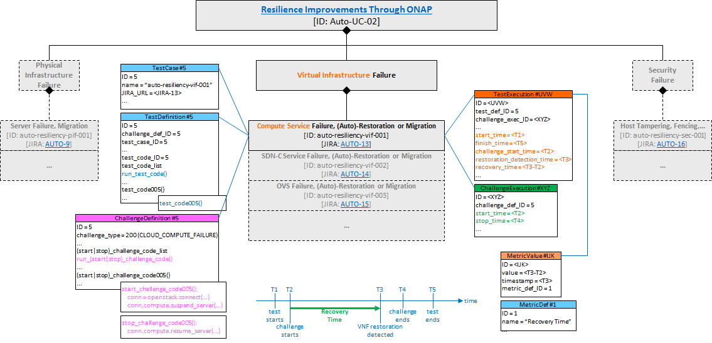

