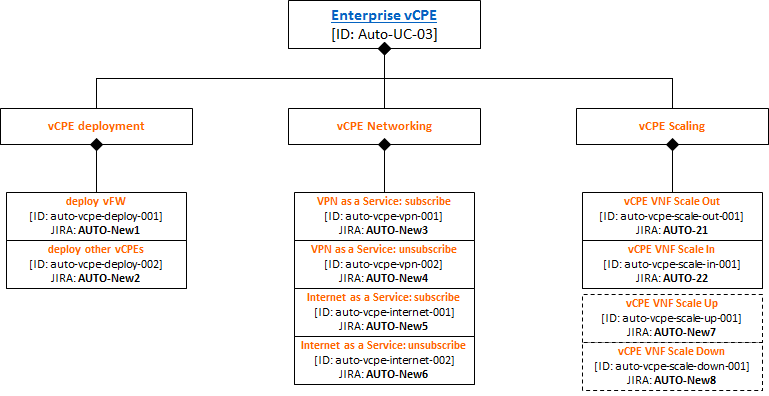

.. This work is licensed under a Creative Commons Attribution 4.0 International License.
.. http://creativecommons.org/licenses/by/4.0
.. SPDX-License-Identifier CC-BY-4.0
.. (c) Open Platform for NFV Project, Inc. and its contributors

===========================================
Auto User Guide: Use Case 3 Enterprise vCPE
===========================================

This document provides the user guide for Fraser release of Auto,
specifically for Use Case 3: Enterprise vCPE.

Description
===========

This Use Case shows how ONAP can help ensure that virtual CPEs (including vFW: virtual firewalls) in Edge Cloud are enterprise-grade.
Other vCPE examples: vAAA, vDHCP, vDNS, vGW, vBNG, vRouter, ...

ONAP operations include a verification process for VNF onboarding (i.e., inclusion in the ONAP catalog), with multiple Roles (Designer, Tester, Governor, Operator), responsible for approving proposed VNFs (as VSPs (Vendor Software Products), and eventually as end-to-end Services).

This process guarantees a minimum level of quality of onboarded VNFs. If all deployed vCPEs are only chosen from such an approved ONAP catalog, the resulting deployed end-to-end vCPE services will meet enterprise-grade requirements. ONAP provides a NBI (currently HTTP-based) in addition to a standard GUI portal, thus enabling a programmatic deployment of VNFs, still conforming to ONAP processes.

Moreover, ONAP also comprises real-time monitoring (by the DCAE component), which can perform the following functions:

* monitor VNF performance for SLAs
* adjust allocated resources accordingly (elastic adjustment at VNF level: scaling out and in, possibly also scaling up and down)
* ensure High Availability (restoration of failed or underperforming services)

DCAE executes directives coming from policies described in the Policy Framework, and closed-loop controls described in the CLAMP component.

ONAP can perform the provisioning side of a BSS Order Management application handling vCPE orders.

Additional processing can be added to ONAP (internally as configured policies and closed-loop controls, or externally as separate systems): Path Computation Element and Load Balancing, and even telemetry-based Network Artificial Intelligence.

Finally, this automated approach also reduces costs, since repetitive actions are designed once and executed multiple times, as vCPEs are instantiated and decommissioned (frequent events, given the variability of business activity, and a Small Business market similar to the Residential market: many contract updates resulting in many vCPE changes).

NFV edge service providers need to provide site2site, site2dc (Data Center) and site2internet services to tenants both efficiently and safely, by deploying such qualified enterprise-grade vCPE.

Preconditions:

#. hardware environment in which Edge cloud may be deployed
#. an Edge cloud has been deployed and is ready for operation
#. enterprise edge devices, such as ThinCPE, have access to the Edge cloud with WAN interfaces
#. ONAP components (MSO, SDN-C, APP-C and VNFM) have been deployed onto a cloud and are interfaced (i.e. provisioned for API access) to the Edge cloud

Main Success Scenarios:

* VNF spin-up

  * vFW spin-up: MSO calls the VNFM to spin up a vFW instance from the catalog and then updates the active VNF list
  * other vCPEs spin-up: MSO calls the VNFM to spin up a vCPE instance from the catalog and then updates the active VNF list

* site2site

  * L3VPN service subscribing: MSO calls the SDNC to create VXLAN tunnels to carry L2 traffic between client's ThinCPE and SP's vCPE, and enables vCPE to route between different sites.
  * L3VPN service unsubscribing: MSO calls the SDNC to destroy tunnels and routes, thus disable traffic between different sites.

* site2dc (site to Data Center) by VPN
* site2internet
* scaling control (start with scaling out/in)

See `ONAP description of vCPE use case <https://wiki.onap.org/display/DW/Use+Case+proposal%3A+Enterprise+vCPE>`_ for more details, including MSCs.

Details on the test cases corresponding to this use case:

* vCPE VNF deployment

  * Spin up a vFW instance by calling NBI of the orchestrator.
  * Following the vFW example and pattern, spin up other vCPE instances

* vCPE VNF networking

  * Subscribe/Unsubscribe to a VPN service: configure tenant/subscriber for vCPE, configure VPN service
  * Subscribe/Unsubscribe to an Internet Access service: configure tenant/subscriber for vCPE, configure Internet Access service

* vCPE VNF Scaling

  * ONAP-based VNF Scale-out and Scale-in (using measurements arriving in DCAE, policies/CLAMP or external system performing LB function)
  * later, possibly also scale-up and scale-down

The following diagram shows these test cases:

Illustration of test cases mapped to architecture, with possible external systems (BSS for Order Management, PCE+LB, Network AI:

.. image:: auto-UC03-TC-archit.png

Test execution high-level description
=====================================

<TBC>

